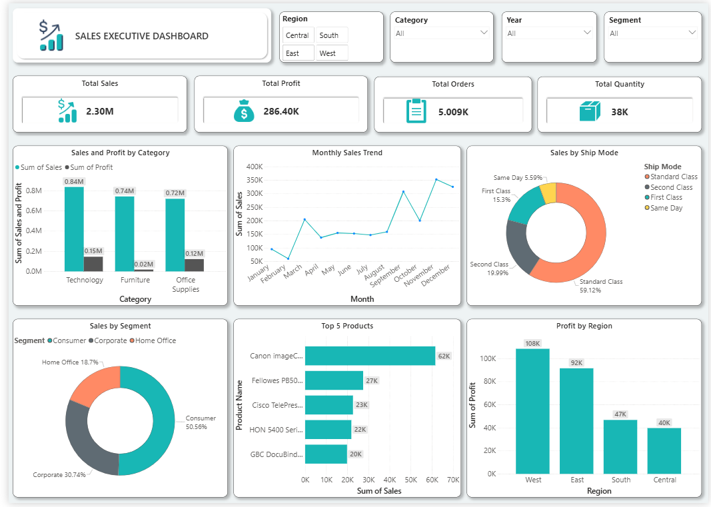

# Sales Executive Dashboard

## 📊 Overview

The Sales Executive Dashboard is an interactive Power BI dashboard developed to analyze sales performance and profitability.

The dataset was obtained from Kaggle and used for analysis in Microsoft Excel and Power BI. The dashboard provides an overview of sales, profit, orders, quantity, product performance, categories, customer segments, shipping modes, and regional profitability.

## 🎯 Project Objective

The objective of this project is to analyze sales and profit performance across different categories, products, customer segments, shipping modes, and regions using an interactive Power BI dashboard.

## 🖥️ Dashboard Preview

## 🔑 Key Features

- Sales and profit analysis by category
- Monthly sales trend analysis
- Sales analysis by ship mode
- Sales analysis by customer segment
- Top 5 products by sales
- Profit analysis by region
- Interactive slicers for Region, Category, Year, and Segment

## 📌 Key Performance Indicators

- Total Sales
- Total Profit
- Total Orders
- Total Quantity

## 📈 Dashboard Visualizations

- Sales and Profit by Category
- Monthly Sales Trend
- Sales by Ship Mode
- Sales by Segment
- Top 5 Products
- Profit by Region

## 📂 Dataset

The dataset was obtained from Kaggle and used for learning and portfolio purposes.

The dataset was stored in CSV format and used for analysis in Power BI.

## 🔄 Project Workflow

**Kaggle Dataset → Excel → Power BI → Data Analysis & Visualization → Interactive Dashboard**

## 🛠️ Tools & Technologies

- Microsoft Excel
- Power BI

## 🧠 Skills Demonstrated

- Data Analysis
- Data Visualization
- Dashboard Development
- KPI Creation
- Interactive Slicers
- Sales & Profit Analysis
- Power BI

## 📁 Project Contents

- `Dataset/Sales_Dataset.csv` – Dataset used for the dashboard
- `Dashboard_Screenshot.png` – Power BI dashboard preview
- `README.md` – Project documentation
